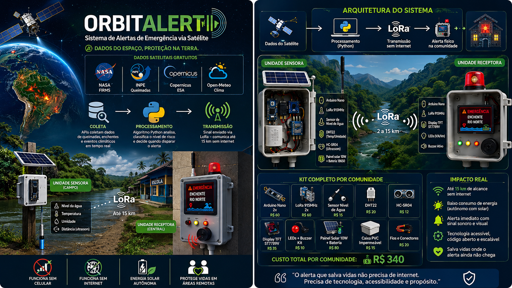
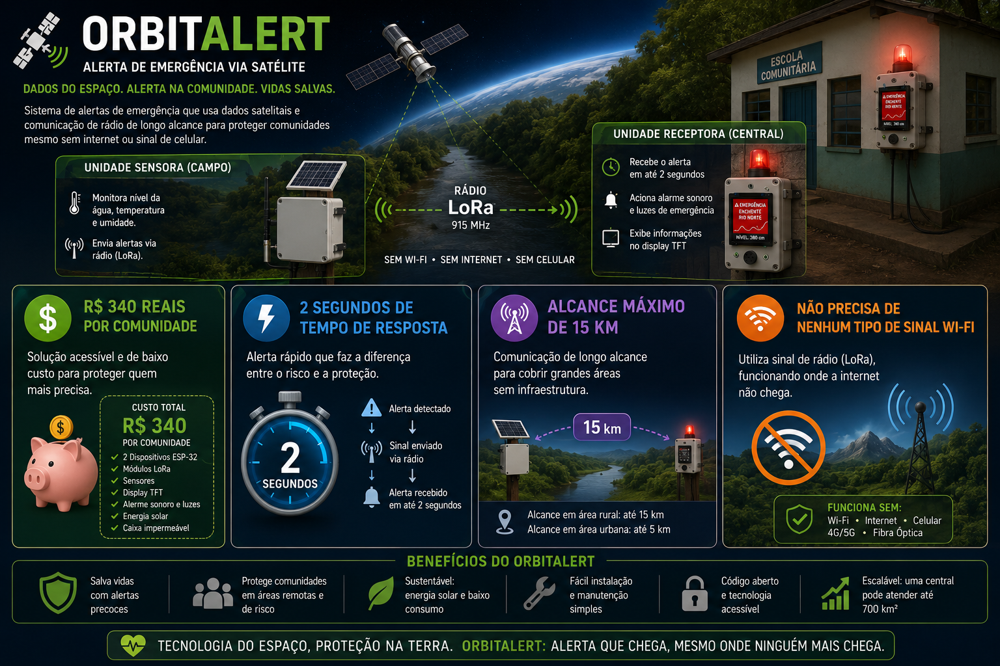

## 1)  PERGUNTA
Faça 20 perguntas para um quiz sobre o projeto.

## RESPOSTA

1. Qual é o principal objetivo do OrbitAlert? -- ACEITA, RESSALTA O OBJETIVO --

a) Enviar alertas de desastres naturais a comunidades sem internet ou sinal de celular ✅
b) Vender equipamentos de telecomunicação para operadoras
c) Criar redes sociais para áreas rurais
d) Substituir a Defesa Civil nas grandes cidades

2. Em 2024, quantas pessoas morreram no RS mesmo após 26 alertas terem sido emitidos? --NEGADA, RUIM COLOCAR MORTES EM UM QUIZ--

a) 84
b) 184 ✅
c) 284
d) 14

3. Segundo o projeto, quantos brasileiros vivem sem cobertura celular? --NEGADA, INFORMAÇÃO MUITO DETALHADA PARA O QUIZ--

a) Mais de 1 milhão
b) Mais de 5 milhões
c) Mais de 14 milhões ✅
d) Mais de 30 milhões

4. Quais APIs de satélites gratuitas o OrbitAlert utiliza para captar dados em tempo real? --NEGADA, INFORMAÇÃO MUITO TÉCNICA PARA PESSOA COMUM--

a) Google Maps, Waze e OpenStreetMap
b) NASA FIRMS, INPE e Copernicus ✅
c) AWS, Azure e Google Cloud
d) SpaceX, Starlink e OneWeb

5. Em qual linguagem é desenvolvido o backend que processa os dados de satélite? --NEGADA, INFORMAÇÃO MUITO TÉCNICA PARA PESSOA COMUM--

a) JavaScript
b) Java
c) Python ✅
d) C++

6. Qual a distância máxima de comunicação via rádio entre o transmissor e o receptor? --ACEITA, RESSALTA A DISTÂNCIA QUE PODE OPERAR--

a) 5 km
b) 10 km
c) 15 km ✅
d) 30 km

7. Qual o custo estimado para instalar o sistema em uma comunidade? --ACEITA, RESSALTA O VALOR BARATO DO OBJETO--

a) R$ 100
b) R$ 340 ✅
c) R$ 1.000
d) R$ 5.000

8. Em quanto tempo o sistema emite alertas físicos e sonoros após detectar um risco? --ACEITA, RESSALTA QUE O ALERTA CHEGA MUITO RÁPIDO--

a) Em até 30 segundos
b) Em até 10 segundos
c) Em menos de 2 segundos ✅
d) Em até 1 minuto

9. Quanto tempo leva para instalar o sistema, segundo o projeto? --ACEITA, RESSALTA QUE O SISTEMA É RAPIDAMENTE INSTALADO--

a) 30 minutos
b) 2 horas ✅
c) 1 dia inteiro
d) Uma semana

10. Cerca de quantas pessoas em comunidades indígenas vivem sem sistemas físicos de alerta? --NEGADA, INFORMAÇÃO INUTIL PARA CONSUMIDOR COMUM--

a) 50 mil
b) 100 mil
c) 500 mil ✅
d) 1 milhão

11. Quais tipos de desastres naturais o OrbitAlert monitora? --ACEITA, INFORMAÇÃO IMPORTANTE PARA CONSUMIDORES--

a) Terremotos e tsunamis
b) Enchentes e queimadas ✅
c) Furacões e tornados
d) Avalanches e erupções vulcânicas

12. Como os dois dispositivos do OrbitAlert se comunicam entre si? --ACEITA, RESSALTA QUE NÃO PRECISA DE WI-FI OU BLUETOOTH--

a) Via rede Wi-Fi local
b) Via Bluetooth de longo alcance
c) Via comunicação por rádio ✅
d) Via conexão por satélite Starlink

13. Qual é o slogan principal exibido no site do OrbitAlert? --NEGADA, INUTIL--

a) Conectando o Brasil ao futuro
b) Protegendo vidas através do espaço ✅
c) Tecnologia que salva o planeta
d) Alerta máximo para todos

14. O que o backend em Python do OrbitAlert faz com os dados recebidos dos satélites? --NEGADA, INFORMAÇÃO MUITO TÉCNICA PARA CONSUMIDOR COMUM--

a) Armazena em nuvem para consulta futura
b) Envia diretamente para redes sociais
c) Classifica o nível de risco por região e dispara alertas automaticamente ✅
d) Gera relatórios mensais para o governo

15. O OrbitAlert depende de qual tipo de infraestrutura para funcionar? --ACEITA, RESSALTA NOVAMENTE QUE NÃO É PRECISO WIFI, BLUETOOTH OU FIBRA ÓPTICA--

a) Internet banda larga e celular
b) Torres de telecomunicação e 5G
c) Nenhuma — opera com rádio e energia solar autônoma ✅
d) Rede de fibra óptica subterrânea

16. Quem pode instalar o sistema do OrbitAlert em uma comunidade? --ACEITA, RESSALTA QUE QUALQUER PESSOA PODE INSTALAR--

a) Apenas engenheiros certificados
b) Somente técnicos da Defesa Civil
c) Qualquer professor ou líder comunitário ✅
d) Exclusivamente funcionários da NASA

17. Qual grupo de público-alvo abriga a unidade receptora como ponto de aviso? --ACEITA, RESSALTA O PUBLICO ALVO DO PROJETO--

a) Escolas particulares
b) Comunidades e postos de saúde ✅
c) Aeroportos regionais
d) Estações de metrô

18. Quanto o Brasil gastou em resposta a desastres em 2025, segundo o site? --NEGADA, INFORMAÇÃO INUTIL--

a) R$ 100 milhões
b) R$ 340 milhões
c) R$ 886 milhões ✅
d) R$ 2 bilhões

19. Qual característica do código do OrbitAlert permite que outros o repliquem e evoluam? --NEGADA, INFORMAÇAO MUITO TÉCNICA--

a) É protegido por patente internacional
b) É vendido sob licença comercial
c) É código aberto com repositório público ✅
d) É exclusivo para uso governamental

20. Qual público é descrito como vivendo às margens de rios em zonas de risco de enchente? --NEGADA, INFORMAÇÃO ÓBVIA--

a) Comunidades indígenas
b) Comunidades ribeirinhas ✅
c) Moradores de grandes centros urbanos
d) Agricultores do agronegócio

-----------------------------------------------------------------------------------

## 2) PERGUNTA
Através desse arquivo, faça duas imagens sobre o tema e mande apenas as imagens aqui. Troque os arduinos uno por arduinos nano, troque tambem o display lcd 16x2 por um display tft st7789v

## RESPOSTA

 <!--imagem2.png-->

-----------------------------------------------------------------------------------

## 3) PERGUNTA

Faça uma imagem mostrando as características do projeto:
- R$ 340 reais por comunidade
- 2 segundos de tempo de resposta
- Alcance máximo de 15 km do sistema
- Não precisa de nenhum tipo de sinal Wi-Fi, utiliza sinal de rádio

## RESPOSTA

 <!--imagem3.png-->

-- A IMAGEM 1 JÁ ESTAVA NO PROJETO DE FRONT -- 

-- O ARQUIVO CITADO NA PERGUNTA 2 SE TRATA DE UM ARQUIVO QUE FIZEMOS CONTENDO TODAS AS INFORMAÇÕES DO PROJETO --